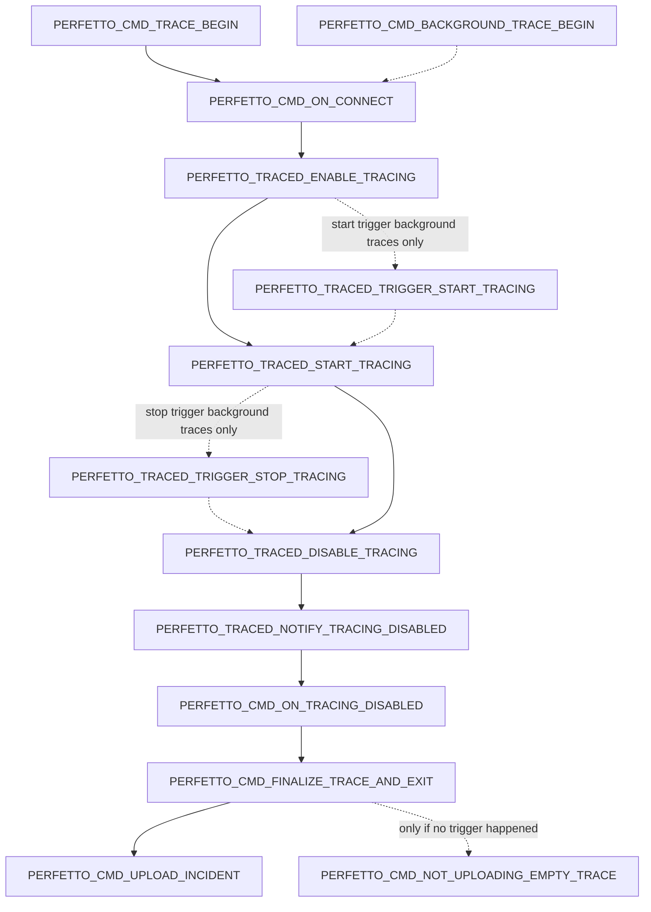

# Statsd Checkpoint Atoms
## Tracing

此图给出了 atoms 以及在 tracing 时的状态转换
上面的所有 atoms 都采集 trace 的 UUID；
`PERFETTO_TRACED_TRIGGER_STOP_TRACING` 是特殊的，因为它*也*采集导致 trace 完成的 trigger 名称。

NOTE: 虚线表示这些转换仅在后台配置中发生；实线的转换在后台和非后台情况下都会发生。

NOTE: 对于后台 traces，*要么*支持 start triggers *要么*支持 stop triggers；两者不能在同一个 trace 中发生。

## 触发器

此图给出了可以触发 trace 完成的 atoms。这些 atoms 不会单独报告，而是按 trigger 名称聚合并作为计数报告。

