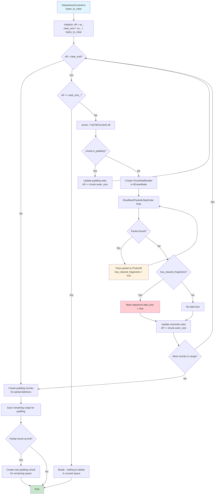
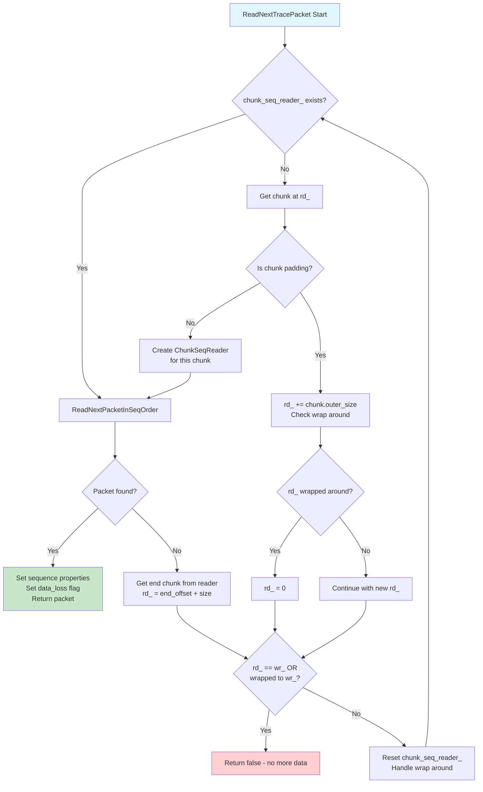
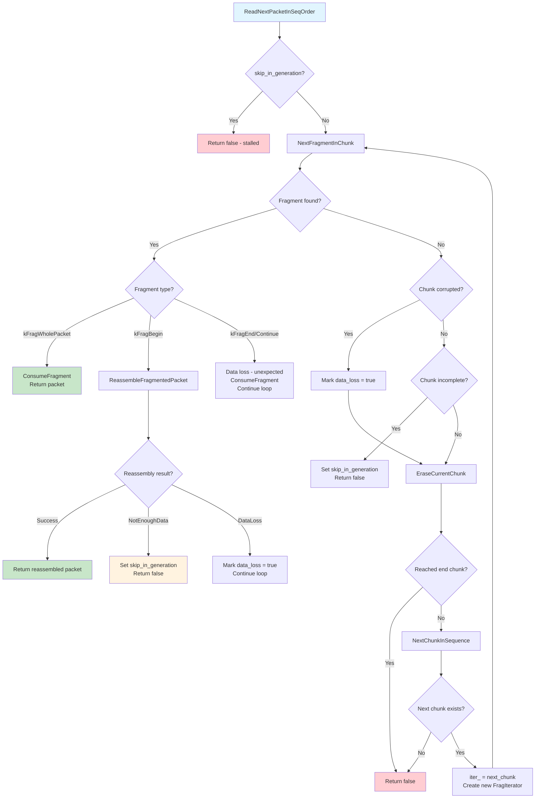

# TraceBuffer V2 设计文档

## 概述

本文档涵盖了 TraceBufferV2 的设计，这是 ProtoVM 之际对核心 trace buffer 代码的 2025 年重写。

TraceBuffer 是 tracing service 用于在内存中保存 traced 数据的非共享用户空间 buffer，直到它被读回或写入文件。对于
[trace config](/docs/concepts/config.md) 的每个 `buffers` 部分，都有一个 TraceBuffer 实例

## 基本操作原理

NOTE: 本部分假设你熟悉 [Buffers and dataflow](/docs/concepts/buffers.md) 中介绍的核心概念。

TraceBuffer 是一个_加强版 ring buffer_。不幸的是，由于协议的复杂性（请参阅[挑战]（#key-challenges）部分），在读回和删除方面，它与普通的面向 byte 的 FIFO ring buffer 相去甚远。

在深入研究其复杂性之前，让我们探索其关键操作。

从逻辑上讲，TraceBuffer 处理重叠的数据流，称为
_TraceWriter Sequences_ ，或简称为 _Sequences_ ：

- 写入 trace 数据的客户端进程充当 _Producer_ 。通常
  1 Producer = 1 Process，但有些情况下一个进程可以托管 >1
  producers（例如，如果它使用 N 个库，每个库都静态链接 tracing
  SDK）
- Producer 声明 DataSources，这是 buffer 中启用/配置的单位。但是，DataSources 并没有作为抽象出现在 buffer 中。只有 TracingService 知道 data sources。
- 每个 data source 使用一个或多个 TraceWriter，通常每个线程一个。
- TraceWriter 写入线性的 TracePackets 序列。

从 TraceBuffer 的角度来看，唯一可见的抽象是 Producer
（由 `uint16_t ProducerID` 标识）和 TraceWriter（由
`uint16_t WriterID` 标识，在 producer 的范围内）。32 位元组
`{ProducerId, WriterID}` 构成了 TraceBuffer 的唯一 Sequence ID。
TraceBuffer 中的一切都由该 key 标识。

基本操作：

- Producers 将 "chunks" 提交到 SMB (Shared Memory Buffer)。
- Chunk 属于 `{ProducerID,WriterID}`，具有 sequence ID 和 flags。
- SMB Chunk 包含一个或多个 fragments。
- 通常 1 fragment == 1 packet，但第一个和最后一个
  fragment 例外，它们 MIGHT 是较长分片 packets 的 continuation。注意
  chunk 可以只包含一个 fragment，而该 fragment 恰好是较大 packet 的 continuation。
- Chunks 几乎原样复制到 TraceBuffer 中，+- 一些元数据
  跟踪（稍后详细介绍）。
- 在读回时，TraceBuffer 重建 packets 序列并重新组装较大的分片 packets。
- 读取是破坏性操作。
- 然而，读取的破坏性涉及（几乎）与读回相同的逻辑，以重建被覆盖的 packets（并在将来将它们传递给 ProtoVM）。

读回提供以下保证：

- TraceBuffer 只输出完全形成的 packets，这些是有效的
  protobuf 编码的 TracePacket 消息。缺少 fragments、缺少 patches 或无效的 packets 将被丢弃。
- 数据丢失总是通过
  `TracePacket.previous_packet_dropped` 标志进行 tracking 和报告。
- TraceBuffer 非常努力地避免_隐藏_有效数据：缺少 fragment
  或其他类似的协议违规不应使序列的其余数据无效。
- 序列的 packets 总是以 FIFO 顺序读回，与写入顺序相同。
- TraceBuffer 还非常努力地尊重属于不同序列的 packets 的 FIFO-ness（这是 TraceBufferV2 引入的新行为）。因此，数据以大致相同的顺序读回（+- 取决于待处理的 patches 和数据丢失，这可能会导致跳跃）。

读回发生在以下情况：

- 在 trace 结束时通过 IPC 读取：这是 perfetto_cmd 默认执行的操作，用于当今大多数 tracing 场景。tracing 停止后，buffer 的所有内容都被读取。
- 定期读入文件：这发生在
  [long tracing mode][lt] 中。每 O(seconds)
  （可配置）buffer 被读取，提取的 packets 被写入 consumer 传递的文件描述符。
- 通过 IPC 定期读取：这些很少见。一些第三方工具如
  [GPU Inspector](https://gpuinspector.dev) 会这样做。在架构上，它们与读入文件的情况没有区别。TraceBuffer 不知道"读入文件"和"通过 IPC 读取"之间的任何区别。这些概念只存在于 TracingServiceImpl 中。

代码层面有四个主要入口点：

Writer 端（Producer 端）：

- `CopyChunkUntrusted()`：在接收到 CommitData IPC 时调用，或在 service 执行 SMB Scraping 时调用（见下文）
- `TryPatchChunkContents()`：仍然是 CommitData IPC 的一部分。

Reader 端：

- `BeginRead()`：在读回时调用，在每个读取批处理开始时调用。
- `ReadNextTracePacket()`：为每个 packet 调用一次，直到 buffer 中没有更多 packets，或 TracingServiceImpl 决定它已为当前任务读取了足够的数据（以避免使 IPC 通道饱和）。

## 关键挑战

### RING_BUFFER vs DISCARD

TraceBuffer 可以在两种模式下运行。

#### RING_BUFFER

这是大多数 traces 使用的模式。它也是最复杂的模式。除非另有说明，本文档重点介绍 RING_BUFFER 模式的操作。
此模式可用于纯 ring buffer tracing，也可以与 `write_into_file` 结合使用以进行 [long traces][lt]
流式传输到磁盘，在这种情况下，ring buffer 主要用于解耦 SMB 和 I/O 活动（并处理 fragment 重新组装）。

[lt]: /docs/concepts/config.md#long-traces

#### DISCARD

此模式用于用户关心 trace 最左侧部分的一次性 traces。这在概念上更简单：一旦到达 buffer 的末尾，TraceBuffer 就停止接受数据。

与 V1 实现相比，行为有轻微变化。V1 尝试对 DISCARD 过于（聪明），允许在写入和读取游标从未交叉的情况下继续向 buffer 写入数据（即，只要 reader 跟上）。
事实证明，这是无用且令人困惑的：将 `DISCARD` 与 `write_into_file` 结合使用会导致 DISCARD 的行为几乎像 RING_BUFFER 的场景。但是，如果 reader 跟不上（例如，由于缺乏 CPU 带宽），TraceBuffer 将停止接受数据（永远）。
我们后来意识到这是一个令人困惑的功能（一个突然停止的 ring buffer），并在尝试组合两者时添加了警告。

V2 不会尝试对读回过于聪明，一旦到达 buffer 的末尾就简单地停止，无论它是否已被读取。

### 碎片化

Packet fragmentation 是 TraceBuffer 大部分设计复杂性的原因。

```
简单的 Fragmentation 示例：
Chunk A (ChunkID=100)      Chunk B (ChunkID=101)      Chunk C (ChunkID=102)
┌─────────────────────┐    ┌─────────────────────┐    ┌─────────────────────┐
│[Packet1: Complete]  │    │[Packet2: Begin]     │    │[Packet2: Continue]  │
│[Packet2: Begin]     │    │ flags: kContOnNext  │    │ flags: kContFromPrev│
│ flags: kContOnNext  │    └─────────────────────┘    │[Packet2: End]       │
└─────────────────────┘                               │[Packet3: Complete]  │
                                                      └─────────────────────┘

Fragmentation 链：Packet2 = [Begin] → [Continue] → [End]
```

**关键的 Fragmentation 挑战**：

- **乱序提交**：由于 SMB scraping，chunks 可能会乱序到达 ChunkID
- **缺少 fragments**：ChunkID 序列中的间隙导致 packet 丢失
- **Patch 依赖**：标记为 `kChunkNeedsPatching` 的 chunks 在 patched 之前会阻塞读回
- **Buffer 环绕**：分片的 packets 可能会跨越 buffer 环绕边界

### 乱序提交

乱序提交很少见但经常存在。它们是由于 Perfetto 早期引入的称为 _SMB Scraping_ 的功能而发生的。

SMB scraping 发生在 TracingServiceImpl 在 _Flush_ 时强制读取 SMB 中的 chunks 时，即使它们未被标记为已完成，也会将它们写入 trace buffer。

这是必要的，用于处理像 TrackEvent 这样的 data sources，这些 sources 可以在没有 TaskRunner 的任意线程上使用，在那里不可能在 trace 协议 Flush 请求时发出 PostTask(FlushTask)。

挑战在于，TracingServiceImpl 在 scraping 时，按线性顺序扫描 SMB 并按找到的方式提交 chunks。但该线性顺序转换为"chunk 分配顺序"，这是不可预测的，有效地导致 chunks 以随机顺序提交。

实际上，这些实例相对较少，因为它们发生在：

- 仅在停止 trace 时，对于大多数 traces。
- 在 [long tracing mode][lt] 中每 O(seconds) 一次。因此必须支持它们，但不需要针对它们进行优化。

重要说明：TraceBuffer 假设所有乱序提交都是批量原子性提交的。OOO 的唯一已知用例是 SMB scraping，它在单个 TaskRunner 任务中一次性提交所有 scraped chunks。

因此，我们假设以下情况不可能发生：

- 任务 1 (IPC 消息)
  - 提交 chunk 1
  - 提交 chunk 3
- 任务 2
  - ReadBuffers（例如，由于 periodic write_into_file）
- 任务 3 (IPC 消息)
  - 提交 chunk 2

TraceBufferV2 的逻辑将通过在按 ChunkID 排序 chunks 后识别的任何 ChunkID 间隙视为数据丢失。

### 数据丢失的跟踪

有几种路径可能导致数据丢失，TraceBuffer 必须跟踪和报告所有这些路径。调试数据丢失是一项非常常见的活动。TraceBuffer 发出任何数据丢失情况的信号非常重要。

有几种不同类型和原因的数据丢失：

- SMB 耗尽：当 TraceWriter 因为 SMB 已满而丢弃数据时会发生这种情况。TraceWriters 通过在下一个 chunk 的末尾附加一个大小为 `kPacketSizeDropPacket` 的特殊 fragment 来发出信号。
- Fragment 重新组装失败：当 TraceBuffer 尝试重新组装分片的 packet 并意识到 ChunkID 序列中存在间隙时会发生这种情况（通常是由于 ring-buffer 模式下的 chunk 被覆盖）。
- Sequence 间隙：当两个 chunks 的 ChunkID 存在不连续性时会发生这种情况。这是由于 ring-buffer 覆盖或在 SMB 中写入时出现其他问题而发生的。
- ABI 违规：当 Chunk 格式错误时会发生这种情况，例如：
  - 其中一个 fragments 的大小超出边界。
  - 第一个 fragment 具有"fragment continuation"标志，但之前没有启动的 fragment。

### 补丁

当 packet 跨越多个 fragments 时，几乎总是涉及 patching，这是由于 protobuf 编码的性质。问题如下：

- TraceWriter 在 chunk 的末尾开始写入 packet。
- 通过这样做，它开始写入 protobuf 消息（至少对于根 TracePacket proto）。在写入时可能会嵌套和打开更多的 protobuf 消息（例如，写入 TracePacket.ftrace_events bundle）
- TraceWriter 在 Chunk 中空间不足。因此，它提交当前 chunk 到 SMB 并获取一个新的 chunk 以继续写入。
- 正在提交的 chunk 包含带有 message 大小的 preamble。然而，该 preamble 目前填充为零，因为我们还不知道 message(s) 的大小，因为它们仍在被写入。
- 只有在嵌套 messages 结束时，TraceWriter 才可能知道要放入 preamble 中的 messages 的大小。但此时，包含 preamble 的 chunk 已被提交到 SMB。TraceWriters 无法触及已提交的 chunks。更重要的是，它们可能已经被 TracingService 消耗了。
- 为了处理这个问题，IPC 协议公开了通过 IPC patch Chunk 的能力，语义为：_如果你 (TracingService/TraceBuffer) 仍然为我的 `{ProducerID,WriterID}` 保留了 ChunkID 1234_，则用内容 `[DE,AD, BE,EF]` patch offset X。

从协议的角度来看，只有 chunk 的最后一个 fragment 可以被 patched：

- 非分片的 chunks 不需要任何 patches。
- chunk 的第一个 fragment（即链的最后一个）按设计不需要任何 patching，因为没有进一步的 fragment。
- 注意，chunk 可以包含一个既是第一个又是最后一个的 fragment，在 fragmentation 链的中间。这也可能需要 patching。
- 一般来说，对于分片为 N 个 fragments 的 packet，除了最后一个 fragment 之外的所有 fragments 都可以（并且通常会）需要 patching。

关于"needs patching"的信息保存在 SMB 的 Chunk flags (`kChunkNeedsPatching`) 中。

`kChunkNeedsPatching` 状态由 `CommitData` IPC 清除，它包含 patches offset 和 payload，以及 `bool has_more_patches` flag。当为 false 时，它会导致 `kChunkNeedsPatching` 状态被清除。

从 TraceBuffer 的角度来看，patching 有以下影响：

- 待处理 patches 的 chunks 会导致序列的读回停滞。
- 停滞不是同步的。TraceBuffer 只是表现为好像序列没有更多数据，要么移动到其它序列，要么在读取所有其它序列后在 ReadNextTracePacket() 中返回 false。
- Fragment 重新组装在有 pending patches 的 chunk 存在时优雅地停止，而不会破坏任何数据或发出数据丢失的信号。
- 由于 patches 通过 IPC 传输，而 IPC 通道按设计是无损的，我们在缺少 patches 的情况下将序列停滞任意时间。
- 然而，停滞不能影响其它序列。
- 因此，缺少 patches 的分片 packet 可能导致一长串 packets（对于相同的 TraceWriter 序列）在读取时永远不会在输出中传播，但不能停滞其它序列。
- 但是，如果待处理 patches 的 chunks 被新数据覆盖，停滞结束，TraceBuffer 将继续读取下一个 packets，发出数据丢失的信号。

### 重新提交

Recommit 意味着再次提交 buffer 中已存在的具有相同 ChunkID 的 chunk。
Recommit 的唯一合法情况是 SMB scraping 后跟实际提交。我们不期望也不支持 Producers 尝试重新提交相同的 chunk N 次，因为这不可避免地会导致未定义的行为（如果 tracing service 已经将 packets 写入文件怎么办？）。

这是 recommit 可能合法发生的情况：

- SMB scraping 发生，TracingService 为仍在被 producer 写入的 chunk 调用 CopyChunkUntrusted。在执行此操作时，它通过传递 `chunk_complete=false` 参数向 TraceBuffer 发出条件信号。
- chunk 被复制到 TraceBuffer 中。按设计，提交 scraped（不完整的）chunk 时，TraceBuffer 会忽略最后一个 fragment，因为它无法判断 producer 是否仍在写入它。
- 稍后，TraceWriter（不知道 SMB scraping）完成写入 chunk 并提交它。
- 此时 TraceBuffer 会覆盖 chunk，可能使用最后一个 fragment 扩展它。

NOTE: kChunkNeedsPatching 和 kIncomplete 是两个不同且正交的 chunk 状态。kIncomplete 与 fragments 无关，纯粹是关于 SMB scraping（以及我们必须保守并忽略最后一个 fragment 的事实）。

影响：

- 不完整的 chunk 会导致序列的读取停滞，类似于 kChunkNeedsPatching 的情况。
- 与前面的情况类似，如果 chunk 被覆盖，停滞会被撤回。
- TraceBuffer 从不尝试读取不完整 chunk 的最后一个 fragment。
- 因此，不完整的 chunk 不能在结束侧分片（呼）。

不完整 chunks 的主要复杂性在于我们无法预先知道它们的 payload 大小。因此，我们必须保守地复制并保留 buffer 中的整个 chunk 大小。

### Buffer 克隆

Buffer 克隆通过 CloneReadOnly() 方法发生。顾名思义，它创建一个新的 TraceBuffer 实例，其中包含相同的内容，但只能读入。这是为了支持 `CLONE_SNAPSHOT` triggers。

架构上，buffer 克隆并不特别复杂，至少在当前的 design 中是这样。主要的设计影响是：

- 确保 TraceBuffer fields 中的状态不包含指针。
- 因此，buffer 中的核心结构使用 offsets 而不是指针（这也恰好更节省内存且对缓存更友好）。
- Stats 和辅助元数据往往是需要注意的事项，bugs 偶尔会隐藏在那里。

### ProtoVM

ProtoVM 是 TracingService 即将推出的功能。它是一种非图灵完备的 VM 语言，用于描述 proto 合并操作，以便在我们覆盖 trace buffer 中的数据时跟踪任意 proto 编码数据结构的状态。ProtoVM 是触发 TraceBuffer V2 重新设计的原因。

不深入其细节，ProtoVM 的主要要求是：在覆盖 trace buffer 中的 chunks 时，我们必须将这些即将被删除的 chunks 中的有效 packets 传递给 ProtoVM。我们必须按顺序这样做，因此复制我们在进行读回时使用的相同逻辑。

关于 ProtoVM 的内部文档：

- [go/perfetto-proto-vm](http://go/perfetto-proto-vm)
- [go/perfetto-protovm-implementation](http://go/perfetto-protovm-implementation)

### 覆盖

由于上述 ProtoVM 的原因，在 V2 设计中，处理 ring buffer 覆盖 (`DeleteNextChunksFor()`) 的逻辑几乎相同 - 并且与读回逻辑共享大部分代码。

我说几乎是因为有一个微妙的区别：删除时，停滞（由于待处理的 patches 或不完整）NOT 是一个选项。旧的 chunks 必须消失，为新的 chunks 腾出空间，无论如何。

因此，覆盖相当于无停滞的强制删除读回。

## 核心设计

涉及两个主要数据结构：

#### `TBChunk`


是存储在 trace buffer 内存中的结构，作为从 SMB chunk 调用 CopyChunkUntrusted 的结果。

TBChunk 与 SMB chunk 非常相似，但有以下注意事项：

- 两者的 sizeof() 相同（16 字节）。这对于保持 patches offsets 一致非常重要。

- SMB chunk 维护 fragments 的 Counter。TBChunk 改为基于 byte 的簿记，因为这减少了读取 iterators 的复杂性。

- 字段的布局略有不同，但它们都包含 ProducerID、WriterID、ChunkID、fragment 计数/大小和 flags。
  SMB chunk 布局是 ABI。TCHunk 布局不是：它是实现细节，可以更改。

- TBChunk 为每个 chunk 维护一个基本的 checksum（仅在 debug builds 中使用）。

简而言之，TBChunk 是：

- 包含一系列 chunks 的 `base::PagedMemory` 线性 buffer。
- 每个 chunk 以 `struct TBChunk` header 为前缀，后跟其 fragments' payload。
- TBChunk header 还包含
  - 读取状态（已消耗的 fragments 有多少 bytes）
  - ABI Flags
    - kFirstPacketContinuesFromPrevChunk
    - kLastPacketContinuesOnNextChunk
    - kChunkNeedsPatching
  - Local flags
    - kChunkIncomplete（用于 SMB-scraped chunks）

### SequenceState

它维护 `{ProducerID, WriterID}` 序列的状态。

它的重要特性是按 ChunkID 顺序维护 TBChunk(s) 的有序列表（逻辑上）
"list" 实际上是一个 offsets 的 CircularQueue，具有 O(1)
`push_back()` 和 `pop_front()` 操作。

- TraceBuffer 持有 `ProducerAndWriterId` -> `SequenceState` 的 hashmap。
- buffer 中每个活动的 {Producer,Writer} 都有一个 `SequenceState`。
- `SequenceState` 持有：
  - producer 的身份（uid、pid、...）
  - `last_chunk_id_consumed`，用于检测 ChunkID 序列中的间隙（数据丢失）
  - chunks 的有序列表（`CircularQueue<size_t>`），存储它们在 buffer 中的 offset。
- `chunks` 队列在将 chunks 追加和从 buffer 中消耗（删除）时保持排序和更新。

`SequenceState` 的生命周期有一个微妙的权衡：

- 一方面，当序列的最后一个 chunk 被读取或覆盖时，我们可以销毁 SequenceState。
- 毕竟，我们必须在某个时刻删除 SequenceState(s)。否则，如果我们有很多线程来来去去，在长时间运行的 traces 中会导致内存泄漏，因为每个 producer 最多可能有 64K 个序列。
- 另一方面，过于积极地删除序列有一个缺点：我们无法在 long-trace 模式下检测数据丢失
  （请参阅 [Issue #114](https://github.com/google/perfetto/issues/114) 和
  [b/268257546](http://b/268257546)）。[Long trace mode][lt] 定期消耗 buffer，因此如果我们要积极处理，所有序列都可以被销毁。
- 这里的问题在于 `SequenceState` 持有 `last_chunk_id_consumed`，用于检测 chunk ids 中的间隙。

TraceBufferV2 使用惰性清理方法平衡这一点：它允许最近删除的 `SequenceState`s 保持活动状态，最多
`kKeepLastEmptySeq = 1024`。请参阅 `DeleteStaleEmptySequences()`。

### FragIterator

一个简单的类，用于对 chunk 中的 fragments 进行 tokenize 并允许仅向前迭代。

它处理不受信任的数据，检测格式错误/越界场景。

它不会改变 buffer 的状态。

### ChunkSeqIterator

一个简单的实用程序类，用于迭代给定 SequenceState 的 TBChunk 有序列表。它只是遵循 SequenceState.chunks 队列并检测间隙。

### ChunkSeqReader

封装了大部分读回复杂性。它按序列顺序读取和消耗 chunks，如下所示：

- 构造时，调用者必须将目标 TBChunk 作为参数传递。这是我们将停止迭代的地方 *。
- 读回时，这是 buffer 中我们想要读取的下一个 chunk。
- 覆盖时，这是我们要覆盖的 chunk。
- 在这两种情况下，由于 OOO 提交，buffer-order 中的下一个 chunk 不一定是 FIFO 顺序中应该消费的下一个 chunk
  （尽管在绝大多数情况下我们期望它们是有序的）。
- 构造时，它一直返回到 `SequenceState.chunks` 的开始（使用 `ChunkSeqIterator`）并从那里开始迭代。
- 它一直读取 packets，直到到达构造函数中传递的目标 TBChunk。
- 在某些情况下（fragmentation），它可能会读取超过目标 chunk。这是为了重新组装在目标 chunk 中开始并稍后继续的 packet。
- 这样做时，它只消耗重新组装所需的 fragment，并保留 chunk 中的其它 packets 不动，以保留全局 FIFO-ness。

### Buffer 顺序 vs Sequence 顺序

Chunks 可以通过两种不同的方式访问：

1. Buffer order：按照它们在 buffer 中写入的顺序。
   在下面的示例中：A1、B1、B3、A2、B2

2. Sequence order：按照它们在 SequenceState 的列表中出现的顺序。


### 写入 chunks

当通过 `CopyChunkUntrusted()` 写入 chunks 时，使用你期望的 ring-buffer 的通常 bump-pointer 模式在 buffer 的 PagedMemory 中分配新的 `TBChunk`。Chunks 是可变大小的，并以 32 位对齐方式连续存储。

chunk 的 offset 也追加到 `SequenceState.chunks` 列表中。

在第一次环绕之后，写入 chunk 涉及删除一个或多个现有的 chunks。删除操作 `RemoveNextChunksFor()` 与读回一样复杂，因为它会重建被删除的 packets，以将它们传递给 ProtoVM。

因此，写入本身是简单的，但现有 chunks 的删除（覆盖）是大部分复杂性所在。这在下一节中描述。

#### DeleteNextChunksFor() 流程



**与 ReadNextTracePacket 的关键区别**：

- **无停滞**：标记为不完整或需要 patches 的 chunks 被强制删除
- **ProtoVM 集成**：在删除之前，有效 packets 被重建并传递给 ProtoVM
- **Padding 管理**：为范围边界处的部分删除创建 padding chunks
- **Stats 跟踪**：更新覆盖统计信息而不是读取统计信息

### 读回 packets

读回 (`ReadNextTracePacket()`) 是 TraceBuffer 大部分复杂性所在的地方，因为它需要从 fragments 重新组装 packets，处理间隙/数据丢失，并处理来自不同序列的 chunks 的交错和乱序。



#### ChunkSeqReader 内部流程

这就是 ReadNextTracePacket() 的工作原理：

- 我们在 write cursor 之后立即开始读取迭代。由于写入只是 FIFO，buffer 中最旧的数据按设计是 write cursor 之后的数据。
- 为简单起见，我们现在忽略 fragmentation，假设每个 chunk 都是自包含的（即，每个 chunk 包含 N fragments = N packets）。
- 如果我们假设没有 fragmentation，并且如果我们还假设没有乱序提交（即，没有 scraping），我们可以只按 buffer 顺序线性迭代，并访问 chunks 直到我们回到 write cursor。
- 因此，我们可以只从每个 chunk 中 tokenize packets，并为每个 `ReadNextTracePacket()` 调用返回一个。完成。



#### 处理乱序 chunks

但事情更复杂。让我们首先只考虑乱序。参考上面的图，假设 write cursor 在 offset=48，就在 B3 之前。

如果我们简单地按 buffer 顺序进行，我们将打破 FIFO-ness，因为我们将首先发出 B3 中包含的 packets，然后是 A2（这很好），最后是 B2（这有问题）。

唯一保留序列内 FIFO-ness 的有效线性化是 [A2,B2,B3]、[B2,B3,A2] 或 [B2,A2,B3]。

为了处理这个问题，我们在读回代码中引入了两层 walk：

- 外层按 buffer 顺序迭代，因为这尊重全局 FIFO-ness，试图以大致相同的顺序获取事件（% chunking）
- 在每一步，内层按序列顺序进行，如下：
  - 它获取 buffer-order visit 找到的下一个 chunk（上面示例中的 B3）。
  - 它通过在 `sequences_` map 中进行 hash-lookup 找到其 SequenceState。
  - 它跳转到 `SequenceState.chunks` 有序列表中的第一个 Chunk。
  - 它按序列顺序进行，直到到达目标 chunk（B3）。
- 外层继续按 buffer 顺序进行，故事重复。

在代码中，外层 walk 由 `TraceBufferV2::ReadNextTracePacket()` 实现，而内层 walk 由 `class ChunkSeqReader::ReadNextPacket()` 实现。

## 基准测试

### Apple Macbook (M4)

```txt
BM_TraceBuffer_WR_SingleWriter<TraceBufferV1>       bytes_per_second=9.77742G/s
BM_TraceBuffer_WR_SingleWriter<TraceBufferV2>       bytes_per_second=12.6395G/s
BM_TraceBuffer_WR_MultipleWriters<TraceBufferV1>    bytes_per_second=8.65385G/s
BM_TraceBuffer_WR_MultipleWriters<TraceBufferV2>    bytes_per_second=11.7582G/s
BM_TraceBuffer_RD_MixedPackets<TraceBufferV1>      bytes_per_second=4.27694G/s
BM_TraceBuffer_RD_MixedPackets<TraceBufferV2>      bytes_per_second=4.35475G/s
```

### Google Pixel 7

```txt
BM_TraceBuffer_WR_SingleWriter<TraceBufferV1>      bytes_per_second=4.4379G/s
BM_TraceBuffer_WR_SingleWriter<TraceBufferV2>      bytes_per_second=3.7931G/s
BM_TraceBuffer_WR_MultipleWriters<TraceBufferV1>   bytes_per_second=3.19148G/s
BM_TraceBuffer_WR_MultipleWriters<TraceBufferV2>   bytes_per_second=3.47354G/s
BM_TraceBuffer_RD_MixedPackets<TraceBufferV1>      bytes_per_second=1.26698G/s
BM_TraceBuffer_RD_MixedPackets<TraceBufferV2>      bytes_per_second=1.35394G/s
``