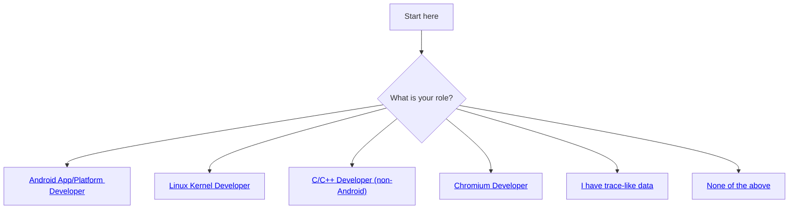
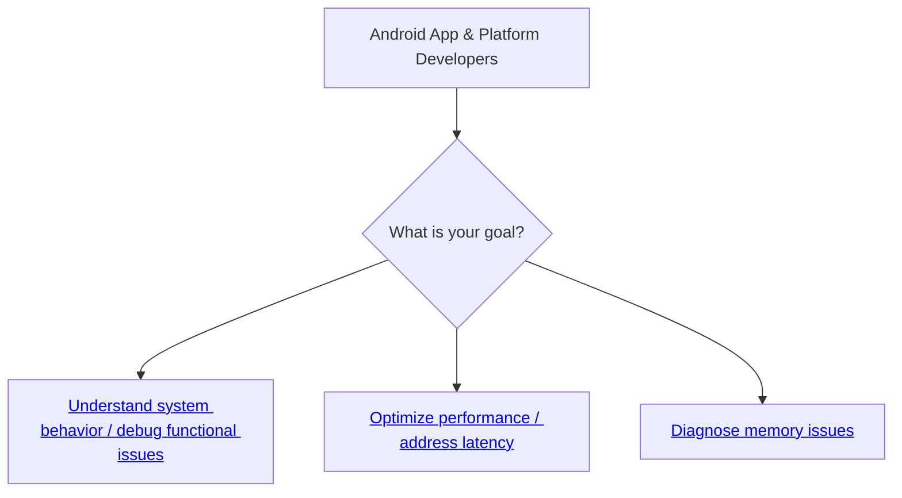

# 如何开始使用 Perfetto？

TIP: 如果你不熟悉 "Tracing" 这个词，或者刚接触性能领域，我们建议先阅读[什么是 Tracing？](/docs/tracing-101.md)页面。如果你不太确定 Perfetto 是什么以及为什么它有用，请先查看 [Perfetto 主页](/docs/README.md)。

Perfetto 是一个大型项目，对于新手来说，了解文档的哪些部分与他们相关可能会让人感到困难。通过关注你使用的技术和你想要实现的目标，本页面将引导你浏览我们的文档，并帮助你尽快使用 Perfetto 解决问题。

我们的文档使用了术语"Tutorials"、"Cookbooks"和"Case Studies"：

- **Tutorials**（教程）是关于如何开始使用 Perfetto 工具的指南。它们侧重于教你使用工具本身，而不是如何使用工具来解决现实世界的问题。
- **Cookbooks**（实战指南）是包含小型、简明指南（配方）的页面，可以让你快速了解如何用 Perfetto 解决具体问题。它们会提供可以复制粘贴的代码片段或可以遵循的指令序列。
- **Case Studies**（案例研究）是详细的、有明确观点的指南，会一步一步教你如何使用 Perfetto 调试和排查一个"垂直"问题的根本原因。它们更多是帮助你解决问题，而不是教你使用 Perfetto 工具。它们还可能大量使用非 Perfetto 工具或命令，只要合适的话。

根据你感兴趣的技术，请选择以下任一章节继续：

## {#android-developers} Android 应用和平台开发者

Perfetto 是 Android 上的**默认 Tracing 系统**。它提供了一种强大的方式来理解 Android 操作系统和应用程序的复杂运作，使开发者不仅能够诊断性能瓶颈，还能分析复杂的功能问题和意外行为。通过捕获系统和应用程序活动的详细、按时间顺序的记录，Perfetto 可以帮助你看到不同组件如何随时间交互。

如果你是开发 Android 应用或 Android 平台代码的开发者（即 Android 操作系统本身），Perfetto 可以帮助你回答各种各样的问题：

1. 为什么某个操作比预期耗时更长？
2. 什么事件序列导致了这个 bug？
3. 在特定用例中，不同进程和系统服务如何交互？
4. 我的组件在特定系统条件下是否正常工作？
5. 为什么我的应用——或整个系统——占用了这么多内存？
6. 我如何优化组件的 CPU 或资源使用？
7. 在关键时刻，各种系统组件的状态是什么？

<?tabs>

TAB: 应用开发者

作为 Android 应用开发者，你可能已经通过一些应用专注的工具使用 Perfetto，这些工具在底层使用 Perfetto。例如：

- [Android Studio Profiler](https://developer.android.com/studio/profile)
- [Android GPU Inspector](https://gpuinspector.dev/)
- [AndroidX Macrobenchmark Library](https://developer.android.com/topic/performance/benchmarking/macrobenchmark-overview)
- [Android SDK 中的 ProfilingManager API](https://developer.android.com/reference/android/os/ProfilingManager)

这些项目在底层使用 Perfetto trace 工具，向应用开发者展示更完善和精心策划的体验。另一方面，它们倾向于暴露较少的功能集，以优先考虑易用性和减少认知负担。

如果你刚开始应用 tracing，你应该首先查看上述工具，因为它们提供了更平滑的学习曲线。另一方面，如果你想使用完整的功能集，并接受更大的复杂性和专业性要求的代价，你可以直接使用 Perfetto 并利用其前沿特性。

本指南以及其余文档可以帮助你开始使用 Perfetto，以更深入地了解你的应用行为及其与 Android 系统的交互。

TAB: Google 平台开发者

作为 Google 平台开发者，Perfetto 深度集成于 Android 平台变更的整个开发过程中。平台开发者可以（链接仅供 Googler 访问）：

- 在开发功能或修复 bug 时本地收集 Perfetto trace
- 在 Android [实验室测试](http://go/crystalball)中收集、分析和可视化 Perfetto trace
- 从 Android [现场遥测](http://go/perfetto-project)系统中收集、分析和可视化 Perfetto trace

以下指南可以帮助你了解 Perfetto 提供的用于全面系统分析和调试的低级工具范围。

TAB: AOSP/OEM/合作伙伴平台开发者

许多 OEM 和合作伙伴在他们自己的公司内部也有与上述类似的本地/实验室/现场系统：请咨询你公司的内部文档了解详情。

以下指南可以帮助你了解 Perfetto 提供的用于全面系统分析和调试的低级工具范围。

</tabs?>

### {#android-understanding-system-behavior} 理解系统行为和调试功能问题

- **不同组件如何交互？导致问题的事件序列是什么？** 系统 trace 提供了跨内核、系统服务和应用程序活动的详细、时间相关的视图。这对于理解复杂的交互和调试跨多个组件的问题非常宝贵。Perfetto UI 是可视化这些 trace 的主要工具。

  - **教程**：[采集和分析系统 trace](/docs/getting-started/system-tracing.md)
  - **参考**：[CPU 调度数据源](/docs/data-sources/cpu-scheduling.md)（通常是理解交互和组件状态的关键）

- **如何在我的代码中看到详细的执行流程和状态？** 要了解代码库（应用或平台服务）中特定操作的时序和序列，请通过插桩（`android.os.Trace` 或 ATrace NDK）添加自定义 trace 点。这些在 trace 中显示为不同的 slice，帮助你调试逻辑流程和测量内部持续时间。

  - **教程**：[使用 atrace 对 Android 代码进行插桩](/docs/getting-started/atrace.md)
  - **参考**：[ATrace 数据源](/docs/data-sources/atrace.md)

- **如何使用 bugreport 或 logcat 等现有诊断文件？** Perfetto 工具通常可以处理常见的 Android 诊断输出，让你利用其可视化和分析功能。
  - Android `bugreport.zip` 文件通常包含 Perfetto trace。Perfetto UI 可以直接打开这些文件，自动提取并加载 trace。
    - **教程**：[可视化 Android bugreport](/docs/getting-started/other-formats.md#bugreport-format)
  - 你可以可视化 `adb logcat` 输出以及 trace 数据。Perfetto 也可以配置为将 logcat 直接包含到新的 trace 中。
    - **教程**：[可视化 adb logcat](/docs/getting-started/other-formats.md#logcat-format)

### {#android-optimizing-performance} 优化性能和解决延迟问题

当组件变慢、出现卡顿或关键操作耗时过长时，Perfetto 提供了调查问题的工具。这可能涉及直接的 CPU/GPU 工作，但在 Android 上，延迟通常源于进程间通信（IPC），如 Binder、锁争用、I/O 等待或低效调度。主要与内存消耗相关的问题，请参阅下面的"诊断内存问题"部分。

- **什么导致我的组件或用户交互出现延迟或卡顿？** 系统级 trace 对于理解多种类型的延迟至关重要。通过可视化线程状态（运行中、可运行、睡眠、I/O 阻塞或锁阻塞）、调度决策以及用户空间事件（如 ATrace 标记或自定义 SDK 事件）的时序，你可以精确定位时间花在哪里。这对于识别以下问题至关重要：

  - **Binder/IPC 延迟**：查看你的组件等待其他进程响应的时间。
  - **锁争用**：识别被阻塞等待互斥锁的线程。
  - **调度延迟**：确定当你的线程变为可运行时是否及时被调度。
  - **I/O 等待**：查看操作是否在磁盘或网络 I/O 上被阻塞。
  - **UI 卡顿**：将系统活动与帧生产和呈现相关联，通常与 FrameTimeline 数据结合使用。

  起点包括：

  - **教程**：[采集和分析系统 trace](/docs/getting-started/system-tracing.md)
  - **参考**：[CPU 调度数据源](/docs/data-sources/cpu-scheduling.md)

- **为什么 UI 特别卡顿或丢帧？** 对于 UI 渲染管道的详细分析，Android 的 FrameTimeline 数据源非常有用。它跟踪从应用渲染到合成再到显示的帧，精确定位哪个阶段错过了截止时间。

  - **教程**：[采集和分析系统 trace](/docs/getting-started/system-tracing.md)
  - **参考**：[FrameTimeline 数据源](/docs/data-sources/frametimeline.md)

- **我的代码的哪些部分消耗最多 CPU 时间（如果 CPU 确实是瓶颈）？** 如果系统 trace 表明你的组件确实在 CPU 上花费了大量时间，那么 CPU 分析可以帮助识别具体负责的函数。Perfetto 可以捕获这些 profile 或可视化从 `simpleperf` 收集的 profile。
  - **教程**：[使用 Perfetto 录制性能 Counters 和 CPU 分析](/docs/getting-started/cpu-profiling.md)
  - **教程**：[可视化 simpleperf 文件](/docs/getting-started/other-formats.md#firefox-json-format)

### {#android-diagnosing-memory-issues} 诊断内存问题

高内存使用会导致性能下降、垃圾回收暂停增加（对于 Java/Kotlin），甚至应用或服务被低内存杀手（LMK）杀死。对于全面解决这些问题，请从我们的详细案例研究开始：

- **案例研究**：[调试 Android 内存使用](/docs/case-studies/memory.md)

Perfetto 还提供了专门用于调查和归因内存使用的工具：

- **如何找出哪些 Java/Kotlin 对象使用最多内存或识别潜在泄漏？** Java/Kotlin 堆转储提供了特定时间点托管堆上所有对象的快照。你可以分析它来查看对象计数、大小和保留路径（什么使对象保持存活），帮助你找到内存泄漏或意外大的对象。

  - **教程**：[录制内存 profile（Java/JVM 堆转储）](/docs/getting-started/memory-profiling.md)
  - **参考**：[Java 堆转储数据源](/docs/data-sources/java-heap-profiler.md)

- **我的代码中原生（C/C++）内存分配在哪里？** 对于原生代码，heap profiling 跟踪 `malloc` 和 `free` 调用（或 C++ 中的 `new`/`delete`），将分配归因于特定的函数调用栈。这有助于识别高原生内存使用或频繁分配和释放的区域。

  - **教程**：[录制内存 profile（原生 heap profiling）](/docs/getting-started/memory-profiling.md)
  - **参考**：[原生 heap profiler 数据源](/docs/data-sources/native-heap-profiler.md)

  - **教程**：[使用 heapprofd 进行原生内存分析](/docs/instrumentation/heapprofd-api.md)

- **系统整体内存使用情况如何？** Perfetto 可以从内核获取系统级内存指标，包括活动内存、可用内存、页面缓存等，帮助你了解系统的整体内存健康状况。

  - **教程**：[采集和分析系统 trace](/docs/getting-started/system-tracing.md)
  - **参考**：[内存 Counter和事件数据源](/docs/data-sources/memory-counters.md)

## {#linux-kernel-developers} Linux 内核开发者

Perfetto 与 Linux 内核深度集成，为内核开发者提供了强大的工具来理解系统行为、调试问题和优化性能。它与以下组件对接：

- **ftrace**：用于捕获详细的、高频的内核事件，如调度变化、系统调用、中断和自定义跟踪点。Perfetto 作为 ftrace 的高效用户空间守护进程。Perfetto 还支持通过 ftrace 采集和可视化整个 funcgraph trace，以在 Timeline 上跟踪每个内核函数的进入/退出。
- **/proc 和 /sys 接口**：用于轮询低频内核统计信息、进程信息（如命令行和父子关系）以及系统级计数器（例如内存使用、CPU 频率）。
- **perf events**：用于基于硬件或软件计数器采样内核和用户空间调用栈的 CPU 分析。

以下是 Perfetto 如何协助 Linux 内核开发和调试：

- **如何理解内核级活动，如调度、系统调用或特定驱动程序行为？** Perfetto 捕获的系统 trace 提供了内核操作的详细 Timeline。你可以配置 Perfetto 记录广泛的 ftrace 事件，让你深入了解调度器、中断处理程序和系统调用等内核子系统。这对于调试内核错误、理解驱动程序交互或分析系统响应能力非常宝贵。Perfetto UI 是可视化和初步分析这些 trace 的主要工具。

  - **教程**：[在 Linux 上采集系统 trace](/docs/getting-started/system-tracing.md)（重点关注 Linux 特定的 ftrace 配置）
  - **参考**：[CPU 调度数据源](/docs/data-sources/cpu-scheduling.md)
  - **参考**：[系统调用数据源](/docs/data-sources/syscalls.md)
  - **参考**：[内存计数器和事件（来自 /proc、/sys 和 kmem ftrace）](/docs/data-sources/memory-counters.md)

- **如何为我的内核代码添加自定义插桩并在 trace 中查看它？** 在开发新内核功能或调试特定模块时，你可以在内核代码中定义新的 ftrace 跟踪点。然后可以配置 Perfetto 收集这些自定义事件，允许你在 Timeline 上将你的插桩与标准内核事件一起可视化，进行有针对性的调试。

  - **教程**：[使用 ftrace 对 Linux 内核进行插桩](/docs/getting-started/ftrace.md)
  - **参考**：[内核跟踪点文档](https://www.kernel.org/doc/Documentation/trace/tracepoints.txt)（外部链接到 kernel.org）

- **内核（或用户空间）的哪些部分消耗最多 CPU 时间？** 如果你怀疑内核或与内核频繁交互的用户空间进程存在 CPU 性能瓶颈，Perfetto 可以使用 `perf` 事件捕获 CPU profile。这有助于识别消耗过多 CPU 周期的函数或内核路径。Perfetto 还可以可视化使用独立 `perf` 工具捕获的 profile。
  - **教程**：[使用 Perfetto 录制性能计数器和 CPU 分析](/docs/getting-started/cpu-profiling.md)
  - **指南**：[可视化 perf 文件](/docs/getting-started/other-formats.md#firefox-json-format)

## {#c-cpp-developers} C/C++ 开发者（非 Android）

如果你是开发非 Android C/C++ 应用的开发者，Perfetto 提供了强大的工具来理解和优化你的应用：

- **如何使用 Perfetto 对我的 C/C++ 代码进行插桩？** Perfetto 提供了一个低开销的 SDK，用于对用户空间代码进行插桩。这允许你添加自定义事件来理解代码执行流程。
  - **教程**：[使用 Perfetto 采集应用内 trace](/docs/getting-started/in-app-tracing.md)
  - **参考**：[Tracing SDK](/docs/instrumentation/tracing-sdk.md)

- **如何优化我的应用的 CPU 使用？** 如果你的应用是 CPU 密集型或你想优化其在 Linux 上的 CPU 消耗，Perfetto 可以捕获 CPU profile。这有助于精确定位消耗最多 CPU 周期的具体函数，指导你的优化工作。

  - **教程**：[使用 Perfetto 录制性能 Counters 和 CPU 分析](/docs/getting-started/cpu-profiling.md)

- **（Linux 特有）如何调查我的 C/C++ 应用的原生内存使用？** 在 Linux 上，Perfetto 的原生 heap profiler 可以跟踪 `malloc`/`free`（或 C++ `new`/`delete`）调用，将分配归因于特定的函数调用栈。这对于识别内存泄漏、理解内存抖动或找到降低应用内存占用的机会至关重要。
  - **教程**：[录制内存 profile（原生 heap profiling）](/docs/getting-started/memory-profiling.md)
  - **参考**：[原生 heap profiler 数据源](/docs/data-sources/native-heap-profiler.md)

## {#chromium-developers} Chromium 开发者

Perfetto 是 Chromium 浏览器及其相关项目（Angle、Skia、V8）的 chrome://tracing 系统的基础。虽然 Chromium 项目有自己广泛的内部文档和采集分析 trace 的最佳实践，但 Perfetto 为此提供了基础工具。

如果你想从 Chrome 捕获 trace，我们的教程提供了一个直接的方法来开始使用 Perfetto UI：

- **教程**：[在 Chrome 上采集 trace](/docs/getting-started/chrome-tracing.md)

有关 Chrome 中实际 trace 分析的一般介绍，[这篇 Perf-Planet 博客文章]（https://calendar.perfplanet.com/2023/digging-chrome-traces-introduction-example/）也是一个有用的资源。

## {#trace-like-data} 任何有"trace 类数据"需要分析或可视化的人

Perfetto 强大的 UI 和 Trace Processor 不仅限于 Perfetto 自己采集的 trace。如果你有来自其他系统的现有 trace 或自定义时间戳数据，你通常可以利用 Perfetto 进行可视化和 profile。

- **我可以在 Perfetto 中打开其他工具的 trace 吗（例如 Chrome JSON、Android Systrace、Linux perf、Fuchsia、Firefox Profiler）？** 可以，Perfetto UI 和 Trace Processor 开箱即用地支持各种常见 trace 格式。这允许你在可能已有的数据上使用 Perfetto 高级可视化和基于 SQL 的分析功能。

  - **指南**：[使用 Perfetto 可视化外部 trace 格式](/docs/getting-started/other-formats.md)
    （列出支持的格式以及如何打开它们）

- **我有自己的自定义日志或时间戳数据。如何在 Perfetto 中查看？** 如果你的数据不是直接支持的格式，你可以将其转换为 Perfetto 原生的基于 protobuf 的格式。这允许你在 Timeline 上表示几乎任何类型的时间戳活动，并在它们之间创建复杂的链接。转换后，你可以使用 Perfetto UI 和 Trace Processor 的全部功能。

  - **指南**：[将任意时间戳数据转换为 Perfetto](/docs/getting-started/converting.md)
  - **参考**：[用于合成 trace 的 TrackEvent protobuf 定义](/docs/reference/synthetic-track-event.md)

## {#not-listed} 以上未列出的人员

如果你的特定角色或用例不属于上述类别，别担心！Perfetto 是一套多功能的工具，其核心功能可能仍然与你的需求高度相关。归根结底，Perfetto 在以下几个关键领域表现出色：

1.  **采集丰富的 Timeline 数据：** Perfetto 提供了相当高性能的 [Tracing SDK](/docs/instrumentation/tracing-sdk.md)，并与系统级数据源（如 Linux/Android 上的 ftrace）深度集成。这允许你捕获来自你的应用程序和/或其运行系统的详细、时间相关的事件。

    - **创造性思考：** 你的问题是否可以通过对你的 C/C++ 代码进行插桩并在 Timeline 上记录事件来理解？我们的[使用 Perfetto 采集应用内 trace 教程](/docs/getting-started/in-app-tracing.md) 展示了如何做。
    - 你是否正在使用产生时间戳数据的现有系统？它可能可以转换为 Perfetto 理解的格式。请参阅我们的[自定义数据转换指南](/docs/getting-started/converting.md)。

2.  **强大的 Timeline 可视化（无需编码）：** [Perfetto UI](/docs/visualization/perfetto-ui.md) 旨在直观地探索大型复杂 trace。你可以导航 Timeline、放大到纳秒级细节、检查事件属性以及关联不同进程和硬件组件之间的活动，所有这些都通过图形界面完成，无需编写任何代码。轨道过滤、展开/折叠进程线程以及可视化事件流等功能帮助你了解系统正在做什么。

    - **探索多样化数据：** Perfetto 可以直接在 UI 中打开各种[外部 trace 格式](/docs/getting-started/other-formats.md)。
    - **发现 UI 功能：** Perfetto UI 还有 [Debug Tracks](/docs/analysis/debug-tracks.md) 等功能，允许通过简单的 UI 配置进行复杂的数据聚合和自定义可视化。

3.  **深入的程序化 trace 分析：** 对于超越视觉检查、自动化分析或提取自定义指标，Perfetto 的 [Trace Processor](/docs/analysis/getting-started.md) 引擎允许你使用 SQL 查询 trace。这个强大的后端可以通过编程方式访问。
    - **自动化你的洞察：** 如果你有重复的分析任务或想从任何 trace（Perfetto 原生或转换的）中提取特定指标，[Trace Processor](/docs/analysis/getting-started.md) 是无价的。

有关 Perfetto 灵活的架构如何适应各种复杂诊断场景的更多灵感，请参阅：

- Snap 关于[大规模客户端 trace]（https://www.droidcon.com/2022/06/28/client-tracing-at-scale/）的演示。
- Collabora 如何使用 Perfetto 进行[虚拟化 GPU 加速分析](https://www.collabora.com/news-and-blog/blog/2021/04/22/profiling-virtualized-gpu-acceleration-with-perfetto/)。

如果你不确定从哪里开始或 Perfetto 如何适用于你的独特情况：

- **浏览我们的文档：** 使用导航侧边栏探索不同的部分，如"概念"、"数据源"或"深入探索"。
- **参与社区：** 在 [Discord](https://discord.gg/35ShE3A) 或我们的[公开邮件列表]（https://groups.google.com/forum/#!forum/perfetto-dev）上提问。
