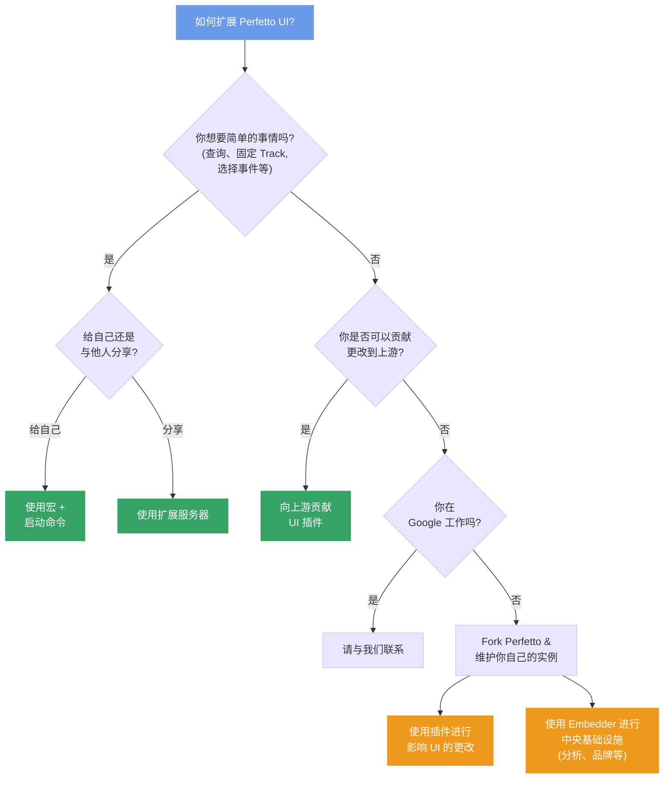

# 扩展 Perfetto UI

Perfetto 提供了几种扩展和自定义 UI 的方法。正确的选择取决于你想要做什么以及你想与谁分享它。

## 我应该使用哪种方法？

## 命令、启动命令和宏

**命令**是单个 UI 操作（固定 Track、运行查询、创建 debug Track）。
**启动命令**每次打开 trace 时自动运行。**宏**是你从命令面板手动触发的命名命令序列。

这些在设置中本地配置，是自定义你自己的工作流的最简单方式。不需要服务器或共享基础设施。

有关如何设置这些，请参阅[命令和宏](/docs/visualization/ui-automation.md)，以及[命令自动化参考](/docs/visualization/commands-automation-reference.md）获取可用命令的完整列表。

## 扩展服务器

**扩展服务器**是向 Perfetto UI 分发宏、SQL 模块和 proto 描述符的 HTTP(S) 端点。
它们是团队共享可重用 trace 分析工作流的推荐方式 — 不是每个人复制粘贴 JSON，而是你在服务器上托管扩展，任何有权访问的人都可以加载它们。

入门的最简单方法是 Fork GitHub 模板仓库并将扩展推送到那里。
Perfetto UI 可以直接从 GitHub 仓库加载。

有关它们如何工作以及如何设置一个，请参阅[扩展服务器](/docs/visualization/extension-servers.md)。

## 插件

**插件**是在 Perfetto UI 内部运行的 TypeScript 模块，可以添加新的 Track、标签页、命令和可视化。与宏和扩展服务器（它们是声明式的）不同，插件可以执行代码并与 UI 深度集成。

如果你想向上游贡献插件，请参阅 [UI 插件](/docs/contributing/ui-plugins.md)。

## Fork Perfetto

如果你需要超出插件、宏和扩展服务器所能提供的更改 —— 例如自定义品牌、分析集成或深度基础设施更改 —— 你可以 Fork Perfetto 并维护你自己的实例。

在 Fork 中，你可以使用 **embedder API** 处理中央基础设施问题（分析、品牌），并使用 **插件** 处理影响 UI 的更改。
